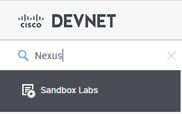
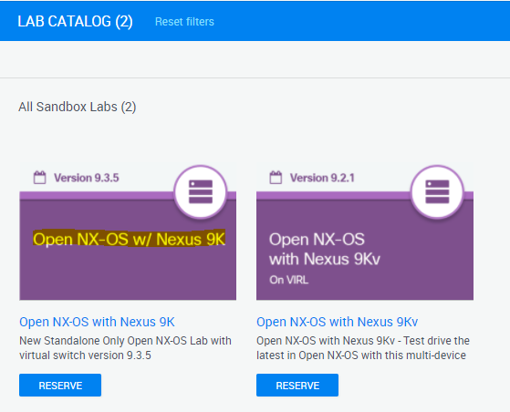

# Merlin3D for Cisco DevNet Sandbox Nexus 9000
[](https://developer.cisco.com/codeexchange/github/repo/automateyournetwork/merlin3d)


# Featuring 


For Videos Please check the Merlin 3D Playlist on YouTube

[YouTube Channel](https://www.youtube.com/playlist?list=PLdeUbXQuf3Teuez4S0lJVprL7p3Fyk_Xj)

For the main Merlin project and what Merlin does please visit:

[Merlin - Network Magic](https://github.com/automateyournetwork/merlin)

You can now run Merlin against a Nexus 9000 in the Cisco DevNet Sandbox.  We have included a custom script and pre-configured testbed file for this purpose.

>To get started, sign up for a Cisco DevNet account at: [DevNet Sandbox](https://devnetsandbox.cisco.com/RM/Topology)

>Once you are signed in, search for "Nexus" in the search dialog at the top left of the screen.



>Select one of the reserved instances - We recommend using the instance running the latest version of NXOS.



>Click "Reserve" after reviewing the reservation details.


You will receive an email from Cisco confirming the reservation along with links to download the Cisco AnyConnect VPN Client and instructions for its installation.

**Cisco AnyConnect VPN Client:**

[AnyConnect VPN Client](https://developer.cisco.com/site/sandbox/anyconnect/)

**Installation guide for Cisco AnyConnect VPN Client:**

[AnyConnect PDF](https://devnetsandbox.cisco.com/Docs/VPN_Access/AnyConnect_Installation_Guide.pdf)

>Click the "VPN Access" tab in the DevNet console and review the information in it.


**Note:** If this is your first time using the Cisco DevNet Sandbox, make sure to review the information in each of the tabs.

In about 15 to 20 minutes, you should receive another email from Cisco with the VPN credentials for your sandbox, including:

* VPN address and port for the connection
* VPN username
* VPN password

>Connect to the DevNet Sandbox VPN using the Cisco AnyConnect VPN Client


Once connected, you will have direct network access to the Nexus 9000 in DevNet.

The "NXOS on Nexus 9k" tab in the DevNet console will show you the details you need to connect to the device, however we have already added this information to the `testbed/testbed_DevNet_Nexus9k_Sandbox.yaml` file.

You can confirm it to be sure.


You're now ready to run Merlin against the DevNet Nexus 9000!

* To transform at least 16 common commands run the following pyATS job as a Docker Container:

# WSL2, Ubuntu, and Docker Desktop

1. Follow these instructions 


[Docker with WSL2 Backend](https://docs.docker.com/docker-for-windows/wsl/)


2. After you have WSL2, Ubuntu, and Docker Desktop installed you can proceed with cloning the repository 

``` console

git clone https://github.com/automateyournetwork/merlin3d.git

```

3. Install Blender

[Download Blender](https://www.blender.org/download/)

4. Download and Install Animation Nodes for Blender

[Download Animation Nodes](https://animation-nodes.com/#download)

5. Launch Blender and Install Animation Nodes


6. Open the Blender File 


Browse to Mgmt0_IO.blend 

7. Connect the VPN to DevNet if you have not already done so 

8. Ensure Docker Desktop is running 

9. In WSL Ubuntu docker-compose up Mgmt0_IO_Graphs

```console

cd merlin3d

~/merlin3d/docker-compose up Mgmt0_IO_Graphs
```

This will run Merlin in a loop 50 times by default 

10. Start your Animation in Blender


You can send PINGs to 10.10.20.254 on the CLI of the device to make the counters change 

```console

ping 10.10.20.254 vrf management packet-size {{ size packets you want to send }} count {{ number of pings }}

```

[Back to the main project](https://github.com/automateyournetwork/merlin)
